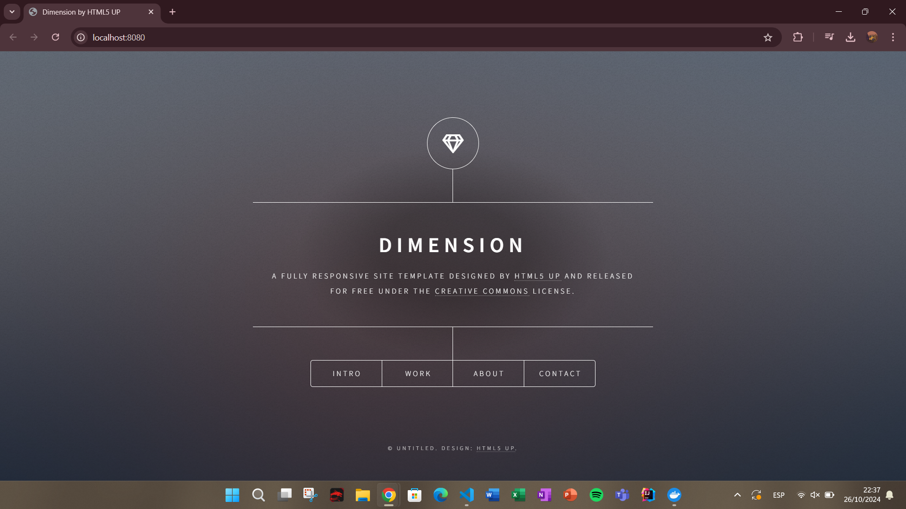

# VOLUMEN TIPO HOST
Un volumen host (o bind mount) es un tipo de volumen donde se monta un directorio o archivo específico del sistema de archivos del host en un contenedor.

```
docker run -d --name <nombre contenedor> -v <ruta carpeta host>:<ruta carpeta contenedor> <imagen> 
```
### En tu computador crear una carpeta llamada nginx y dentro de esta carpeta crea otra llamada html. Como se aprecia en la figura.


### Crear un volumen tipo host con la imagen nginx:alpine, mapear todos por puertos, para la ruta carpeta host colocar el directorio en donde se encuentra la carpeta html en tu computador y para la ruta carpeta contenedor: /usr/share/nginx/html (esta ruta se obtiene al revisar la documentación de la imagen)


```
docker run -d --name srv-nginx --publish published=8080,target=80 -v C:/Users/Emilio/Desktop/p3/2024B-ISWD633-practica3-EmilioArmas/nginx/html:/usr/share/nginx/html nginx:alpine
```

### ¿Qué sucede al ingresar al servidor de nginx?
Se muestra el error 403 Forbidden. Este error se da porque no existe el archivo index.html en el directorio del host.

### ¿Qué pasa con el archivo index.html del contenedor?
Al utilizar un volumen el directorio html del contenedor se sobreescribe y por ende se borra el archivo index.html, mostrando el error 403.

### Ir a https://html5up.net/ y descargar un template gratuito, descomprirlo dentro de tu computador en la carpeta html
### ¿Qué sucede al ingresar al servidor de nginx?
Se visualiza la plantilla descargada.



### Eliminar el contenedor
```
docker rm -f srv-nginx
```

### ¿Qué sucede al crear nuevamente el mismo contenedor con volumen de tipo host a los directorios definidos anteriormente?
Los archivos de la plantilla no se borraron con el contenedor por lo que se volvieron a mostrar al ingresar a este.

### ¿Qué hace el comando pwd?
Muestra la ruta completa del directorio actual (Print Working Directory).


Si quieres incluir el comando pwd dentro de un comando de Docker, lo puedes hacer de diferentes maneras dependiendo del shell que estés utilizando.


### Volumen tipo host usando PWD y PowerShell
```
docker run -d --name <nombre contenedor> --publish published=<valorPuertoHost>,target=<valor> -v ${PWD}/<ruta relativa>:<ruta absoluta> <nombre imagen>:<tag> 
```

### Volumen tipo host usando PWD (Git Bash)

```
docker run -d --name <nombre contenedor> --publish published=<valorPuertoHost>,target=<valor> -v $(pwd -W)/html:/usr/share/nginx/html <nombre imagen>:<tag> 
```

### Volumen tipo host usando PWD (en Linux)

```
docker run -d --name <nombre contenedor> --publish published=<valorPuertoHost>,target=<valor> -v $(pwd)/html:/usr/share/nginx/html <nombre imagen>:<tag> 
```

